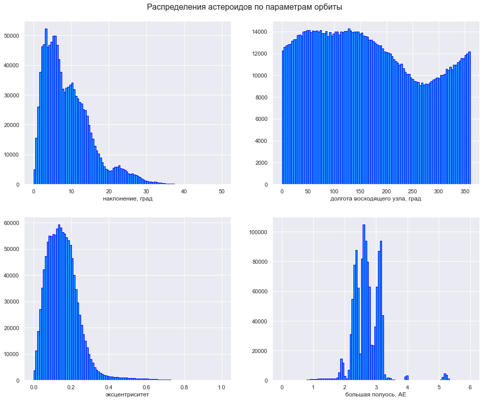

# Analysis the distribution of asteroids in the solar system

Analyze the distribution of asteroids by various orbital parameters using the Lowell Observatory database, with a focus on Centaurs and Kuiper Belt Objects, including the search for asteroids on polar orbits.

## Data

The following data were provided for the project:
- Lowell Observatory database

## Libraries used
pandas, matplotlib, seaborn
